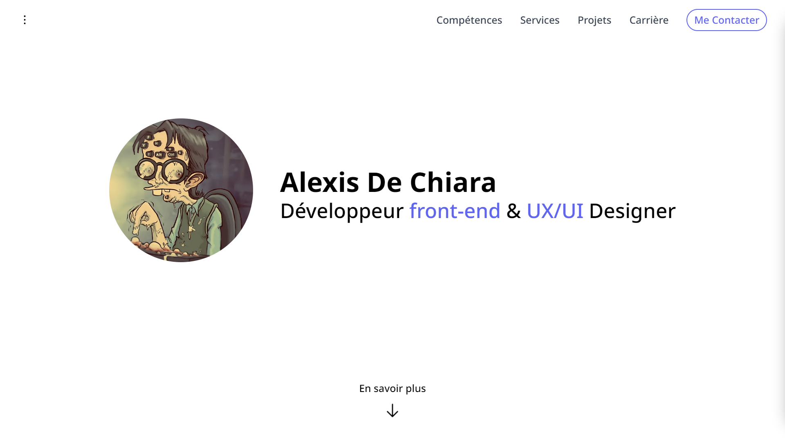

# Portfolio de Alexis De Chiara

## Présentation

Ce repository contient mon portfolio personnel, qui met en valeur mes compétences, mes projets et mes réalisations. Il est conçu pour offrir aux visiteurs une vision complète de mon parcours professionnel, mes réalisations et mes compétences techniques.



## Fonctionnalités

✅ Utilisation de **Tailwind CSS** (@astrojs/tailwind) avec le support du mode sombre
✅ Optimisation du **SEO** (astro-seo)
✅ Génération de la **sitemap automatique** (@astrojs/sitemap)
✅ Utilisation de **Storyblok** (@storyblok/astro)
✅ Déployable directement sur **vercel** (@astrojs/vercel)
✅ Utilisation de **Prettier** (prettier-plugin-astro ) et **Eslint** (eslint-plugin-astro)
✅ Optimisation des scripts externe avec partytown (@astrojs/partytown)
✅ Utilisation des icônes simplifiées (astro-iconify)
✅ Génération automatique des licenses (astro-licenses-report)

## Structure du projet

```
/
├── public/
│   └── favicon.svg
├── src/
│   ├── assets/
│   │   └── styles/
│   │       └── base.css
│   │
│   ├── components/
│   │   └── Script.astro
│   │
│   ├── icons/
│   │   └── wave.astro
│   │
│   ├── layouts/
│   │   └── Layout.astro
│   │
│   ├── pages/
│   │   ├── 404.astro
│   │   ├── index.astro
│   │   ├── mentions-legales.astro
│   │   └── projets.astro
│   │
│   └── storyblok/
│       └── ...
│
├── .eslintrc.json
├── .prettierrc
├── astro.config.mjs
├── package.json
├── prettier.config.js
├── tailwind.config.js
└── tsconfig.json
```

## Variables d'environnements

 Nom | Fonction |
---|---|
 STORYBLOK_TOKEN | Permet de se connecter à la base de données de storyblok |

## Pour en savoir plus

N'hésitez pas à consulter la [documentation officiel de astro](https://docs.astro.build) et le [guide d'utilisation de Storyblok](https://www.storyblok.com/tc/astro)

## License

Mon portfolio est sous licence MIT - voir le fichier [LICENSE](./LICENSE.md) pour plus de détails.
